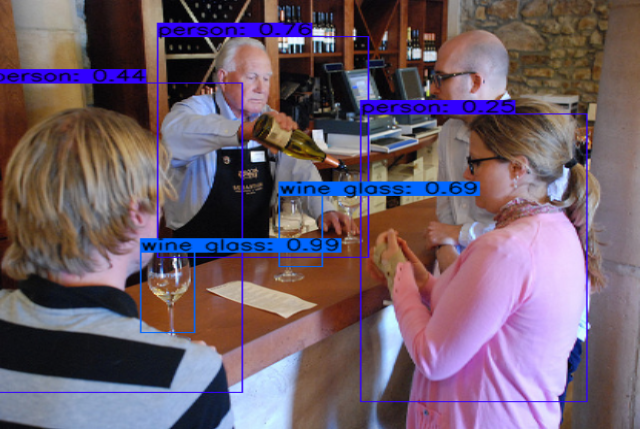

# Zybo Yolo
  
YOLOv3 tiny example implementation for Intuitus CNN accelerator using a ZYBO-Z7-20 FPGA board. 

## Features
- [x] Capture image using v4l2 camera 
- [x] Plot results to framebuffer 
- [x] Run Yolov3 tiny inference on FPGA 
- [x] Inference time downto 82 ms
- [x] Low power consumption due to FPGA implementation

## Run test application:
````sh
python zybo_yolo/test-yolov3-tiny.py --use_cam --use_fb
````

## Hardware Requirements
- Zybo-Z7-20 Board 
- microSD card >=8GB 
- Optional:
    - PCAM-5C 
    - HDMI Display 

## Setup Hardware
1. SD card: Format first Partition (300-500MB) to FAT and the second partition to EXT4
2. Copy BOOT.BIN and image.ub to the first partition 
3. Download linaro-developer and extract it to the second partition 
4. Copy intuitus.ko to extracted rootfs.
5. Connect ethernet, pcam, display, keyboard and power to Zybo and insert the SD card
6. Boot up the system
7. Update the OS using ``sudo apt-get upgrade && apt-get update``
8. Install v4l2, cmake, opencv and swig
9. Install PyEnv
10. Install python 3.6.10 and activate it
11. Install numpy, opencv-python, elevate, pathlib, wget and argparse using pip 
12. Clone <https://github.com/LukiBa/Intuitus-intf.git>
13. Install the interface using ``pip install -e .`` 
14. Clone <https://github.com/LukiBa/zybo_yolo.git>
15. cd to intuitus.ko location and insert device driver using ``sudo insmod intuitus.ko``
16. Run test application using ``python zybo_yolo/test-yolov3-tiny.py --use_cam --use_fb``

## Results <font size="-1"><sup>[1]</sup> <sup>[2]</sup></font> 
| Mem Clk [MHz] | PE Clk [MHz] | P<sub>idle</sub> [W] | P<sub>exec</sub> [W] | inference time [ms] |
| ------ | ------ | ------ | ------ | ------ |
| 100 | 100 | 2.73 | 3.12 | 112 |
| 100 | 175 | 3.32 | 3.85 | 91 |
| 100 | 200 | 3.60 | 4.10 | 89 |
| 125 | 200 | 3.57 | 4.10 | 86 |
| 125 | 225 | 3.83 | 4.35 | 84 |
| 125 | 250 | 4.02 | 4.57 | 83 |

[1] The average time of 1000 calls of the Network is used as a measure for inference time (input size: 384x384).  
[2] The power is the power consumption of the board without a connected PCAM and display.

  

## Related Projects: 
| Project | link |
| ------ | ------ |
| Intuitus Model Converter | <https://github.com/LukiBa/Intuitus-converter.git> |
| Intuitus Interface | https://github.com/LukiBa/Intuitus-intf.git |
| Intuitus device driver | link to kernel module comming soon (contact author for sources) |
| Vivado Yolov3-tiny example project | https://github.com/LukiBa/zybo_yolo_vivado.git |
| Intuitus FPGA IP | encrypted trial version comming soon (contact author) |

## Author
Lukas Baischer   
lukas_baischer@gmx.at
